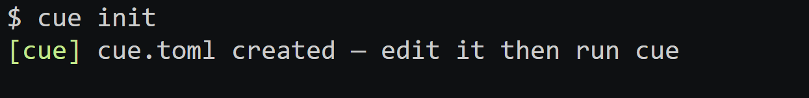
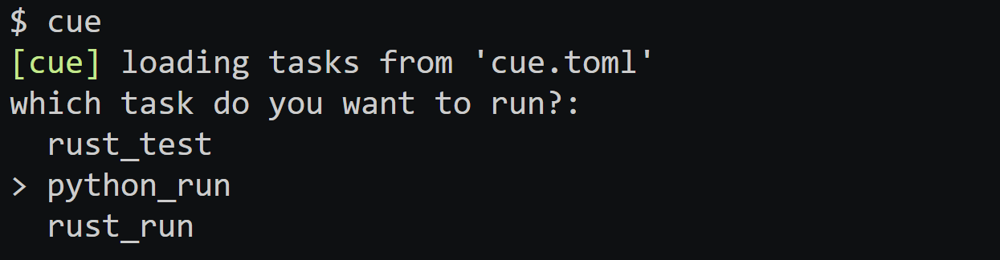
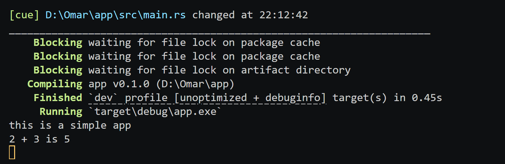

<div align="center">


# cue

A fast, lightweight file watcher that automatically runs your command on every save.

</div>

> **Note:** cue is still under active development — usable and tested, but features may change.

---

## Contents

- [Installation](#installation)
- [Quick Start](#quick-start)
- [Watch Mode](#watch-mode)
- [Watch by Extensions](#watch-by-extensions)
- [Tasks](#tasks)
- [Local Project Config](#local-project-config)
- [Debounce](#debounce)
- [Quiet Mode](#quiet-mode)
- [Zero-Config Mode](#zero-config-mode)
- [Benchmarks](#benchmarks)
- [How It Works](#how-it-works)

---

## Demo

**Initialize a project config**



**Pick a task to run**



**Watch and run on every save**



---

## Installation

**macOS / Linux**

```bash
curl -sSf https://raw.githubusercontent.com/ozx1/cue/master/install.sh | sh
```

**Windows (PowerShell)**

```powershell
iwr https://raw.githubusercontent.com/ozx1/cue/master/install.ps1 -UseBasicParsing | iex
```

**From source**

```bash
cargo install --path .
```

**or install via cargo**

```bash
cargo install cue-watch
```

---

## Quick Start

```bash
cue -w src -r "cargo run"
```

Every time you save a file inside `src`, cue runs `cargo run`. That's all there is to it.

---

## Watch Mode

Watch files or directories and run a command on every save.

```bash
cue -w <files or dirs> -r "<command>"
```

**Examples**

```bash
cue -w src -r "cargo run"
cue -w src tests -r "cargo test"
cue -w main.go -r "go run main.go"
```

> **Tip:** Always wrap your command in quotes so its flags go to your command, not to cue.

**Flags**

| Flag           | Short | Description                          |
| -------------- | ----- | ------------------------------------ |
| `--watch`      | `-w`  | Files or directories to watch        |
| `--run`        | `-r`  | Command to run on change             |
| `--extensions` | `-e`  | Watch files by extension             |
| `--debounce`   | `-d`  | Debounce window in ms (default: 150) |
| `--quiet`      | `-q`  | Suppress cue's own log output        |
| `--no-clear`   | —     | Don't clear the screen between runs  |

---

## Watch by Extensions

Watch all files matching a given extension recursively from the current directory.

```bash
cue -e rs -r "cargo run"
cue -e js ts -r "node index.js"
```

---

## Tasks

Save a watch + command pair as a named task and run it anywhere with a single word. Tasks are stored globally and available from any directory.

### Add

```bash
cue task add <n> -w <files or dirs> -r "<command>"
```

### Run

```bash
cue run <n>
```

### List

```bash
cue task list
```

### Edit

```bash
cue task edit <n> -w <new paths>
cue task edit <n> -r "<new command>"
cue task edit <n> -w <new paths> -r "<new command>"
```

### Rename

```bash
cue task rename <n> <new_name>
```

### Remove

```bash
cue task remove <n>
```

### Override on run

Run a task with a different path or command without permanently editing it:

```bash
cue run build -w src/main.rs
cue run build -r "cargo build"
```

**Examples**

```bash
cue task add build -w src -r "cargo build --release"
cue task add test -w src tests -r "cargo test"

cue run build
cue run test
```

**Flags**

| Flag         | Short | Description                                  |
| ------------ | ----- | -------------------------------------------- |
| `--watch`    | `-w`  | Override watch paths                         |
| `--run`      | `-r`  | Override command                             |
| `--debounce` | `-d`  | Debounce window in ms                        |
| `--global`   | `-g`  | Force global tasks even if `cue.toml` exists |
| `--quiet`    | `-q`  | Suppress cue's own log output                |
| `--no-clear` | —     | Don't clear the screen between runs          |

---

## Local Project Config

`cue run` ( or `cue` ) looks for a `cue.toml` in your current directory first. If found, tasks are loaded from it instead of your global tasks — great for committing your cue setup alongside your project.

Create one with:

```bash
cue init
```

Or use a language template:

```bash
cue init rust
cue init go
cue init node
```

**Supported templates:** Rust, C, C++, Go, Zig, Swift, Haskell, Node.js, Ruby, PHP, Lua, Elixir, Java, Kotlin, CSS/SCSS, Shell

### cue.toml format

```toml
default = "build"

[tasks.build]
watch = ["src"]
run = "cargo build --release"

[tasks.test]
watch = ["src", "tests"]
run = "cargo test"
```

### Config resolution

| Situation                        | What cue loads              |
| -------------------------------- | --------------------------- |
| `cue.toml` exists in current dir | Local tasks from `cue.toml` |
| No `cue.toml`                    | Global tasks                |
| `--global` / `-g` flag           | Global tasks (always)       |

---

## Debounce

Editors often write to disk multiple times on a single save. cue waits **150ms** after the last detected change before running your command — so you always get exactly one run per save.

Adjust it with `-d`:

```bash
cue -w src -r "cargo build" -d 500
```

---

## Quiet Mode

Suppresses cue's own log lines and only shows output from your command. Works with `cue`, `cue run`, and `cue run <n>`.

Does **not** suppress errors or output from `task add`, `task remove`, `task edit`, or `task list`.

```bash
cue -q
cue run -q
cue run my_task -q
cue -w src -r "cargo run" -q
```

---

## Zero-Config Mode

Run `cue` or `cue run` with no arguments.

```bash
cue
cue run
```

If a `cue.toml` exists, cue loads it. Then:

- **If a default task is set** — cue runs it immediately
- **If no default is set** — cue shows an interactive picker

```toml
default = "build"
```

```
[cue] loading tasks from 'cue.toml'
[cue] default task 'build' — running it
```

```
[cue] loading tasks from 'cue.toml'
? which task do you want to run?
> build
  test
  lint
```

Use `--global` / `-g` to skip `cue.toml` and always load global tasks:

```bash
cue --global
```

---

## Benchmarks

Benchmarked against the most popular file watchers (intel i7-9850H)

| Tool      | Startup   | Idle Memory | CPU (idle) | Commands fired (50 changes) |
| --------- | --------- | ----------- | ---------- | --------------------------- |
| **cue**   | **219ms** | **7.6 MB**  | **0%**     | 27/50 ¹                     |
| watchexec | 214ms     | 13.5 MB     | 0%         | 51/50                       |
| chokidar  | 482ms     | 37.6 MB     | 0%         | 1/50 ²                      |
| nodemon   | 533ms     | 41.2 MB     | 0%         | 102/50 ³                    |

¹ Intentional — cue debounces and kills stale runs, so rapid saves collapse into one clean run per burst. Tune with `-d`.  
² chokidar's debounce is too aggressive for rapid changes, missing most events.  
³ nodemon fires duplicate events per change.

**Run the benchmarks yourself:**

```bash
bash ./benchmark.sh
```

Requires `watchexec`, `nodemon`, or `chokidar` for comparison. The script auto-detects what's installed and skips the rest.

---

## How cue Works

1. cue starts watching all the paths you provide
2. A file is saved — cue waits for the debounce window to pass
3. If the previous command is still running, cue kills it
4. cue runs your command fresh

---

## Contributing

Found a bug or have an idea? Open an issue or submit a pull request — contributions are welcome.

---

## License

MIT — [LICENSE](LICENSE)
